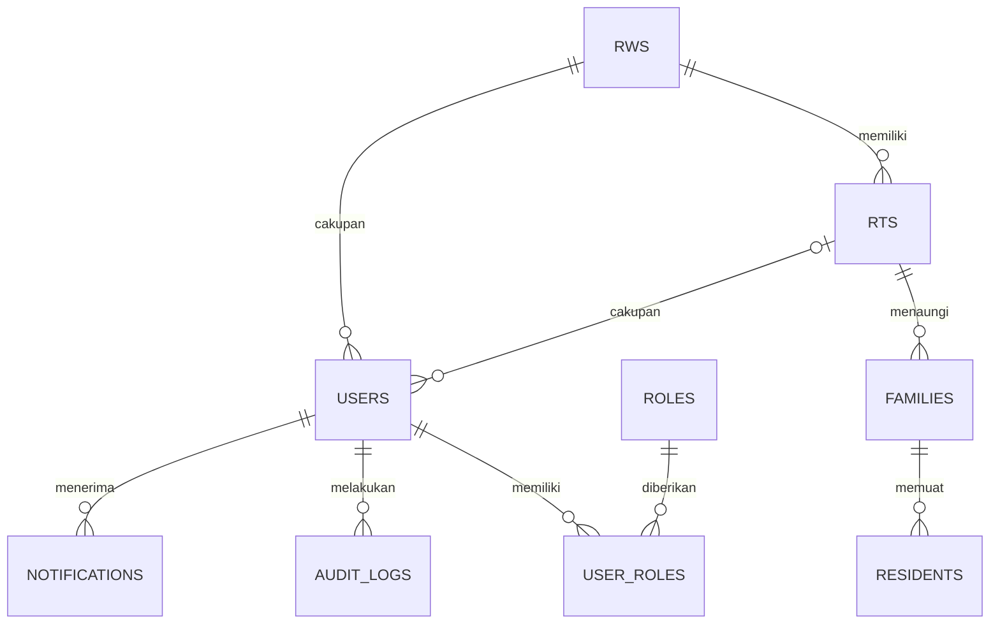
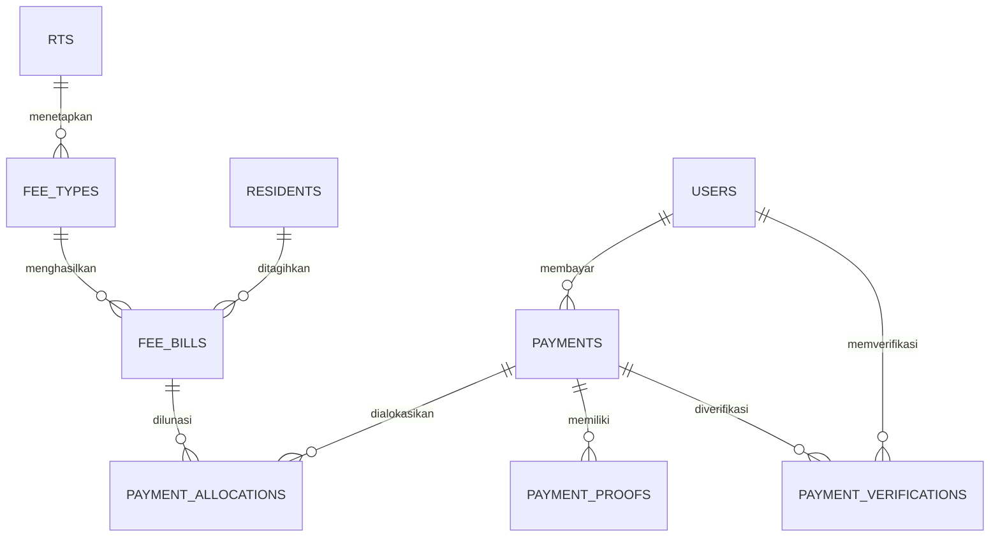
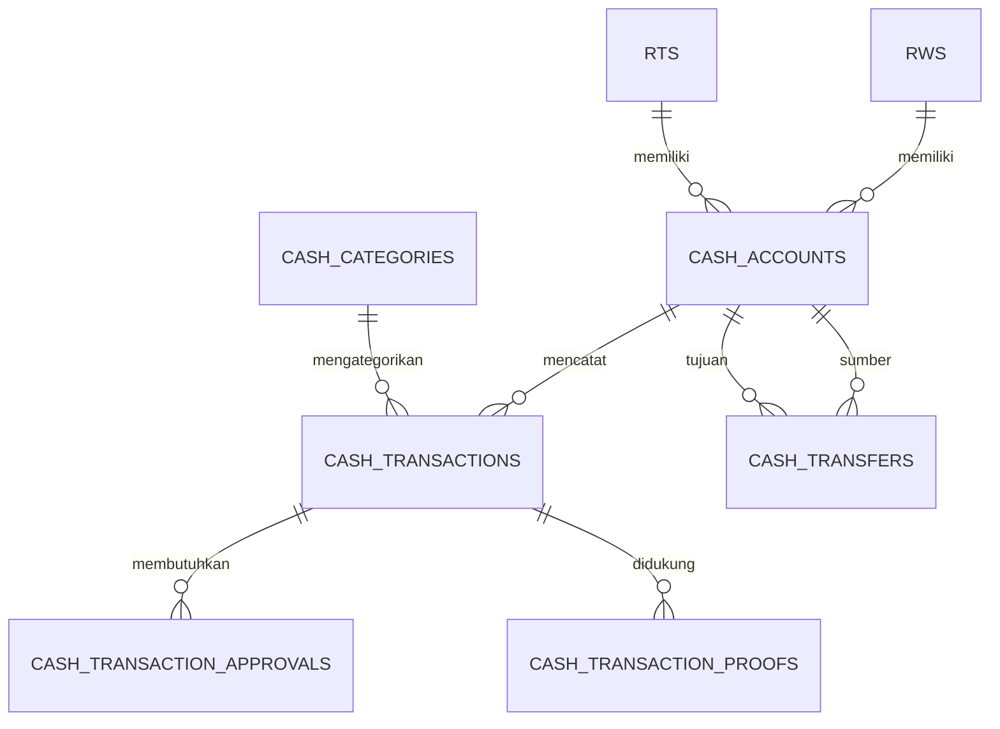
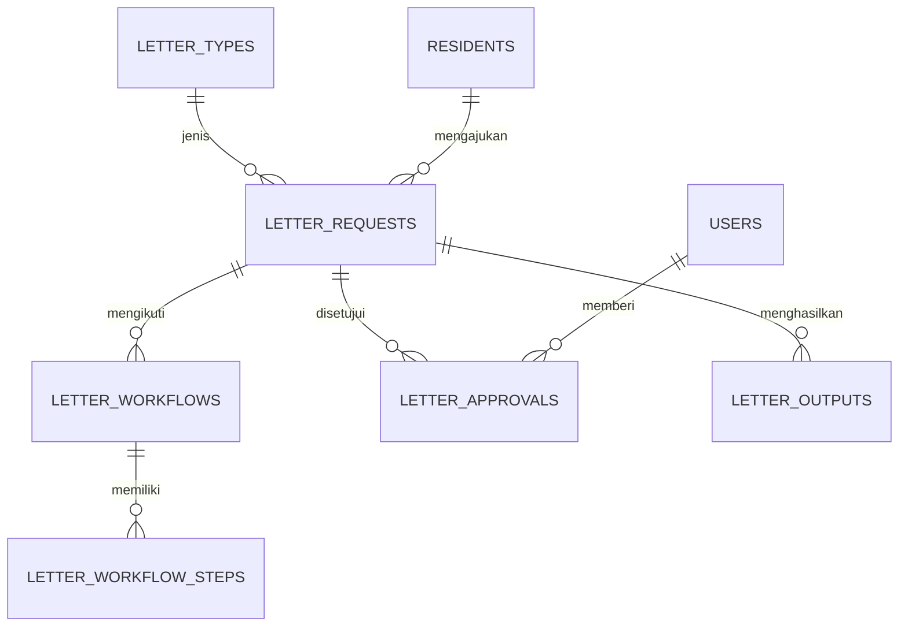
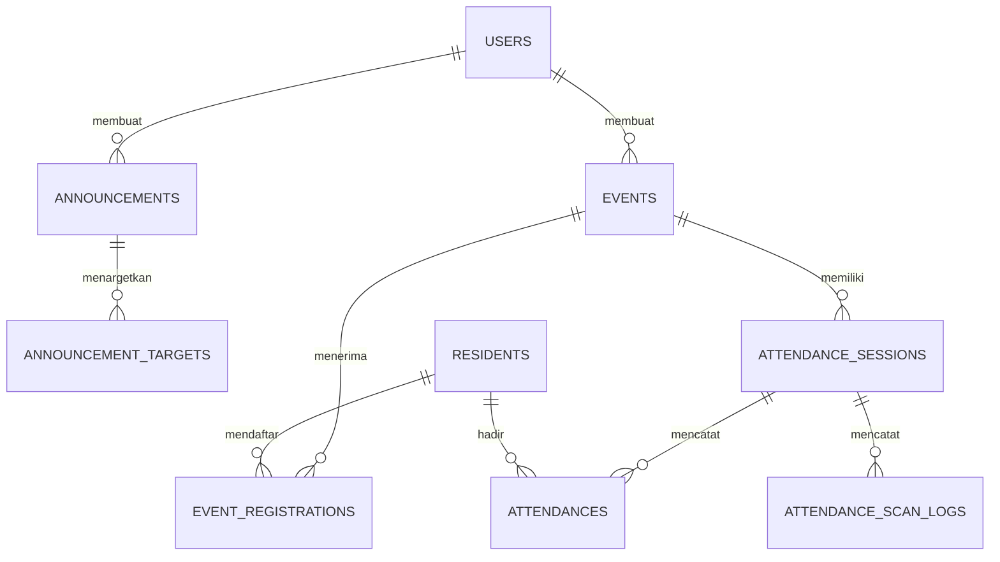
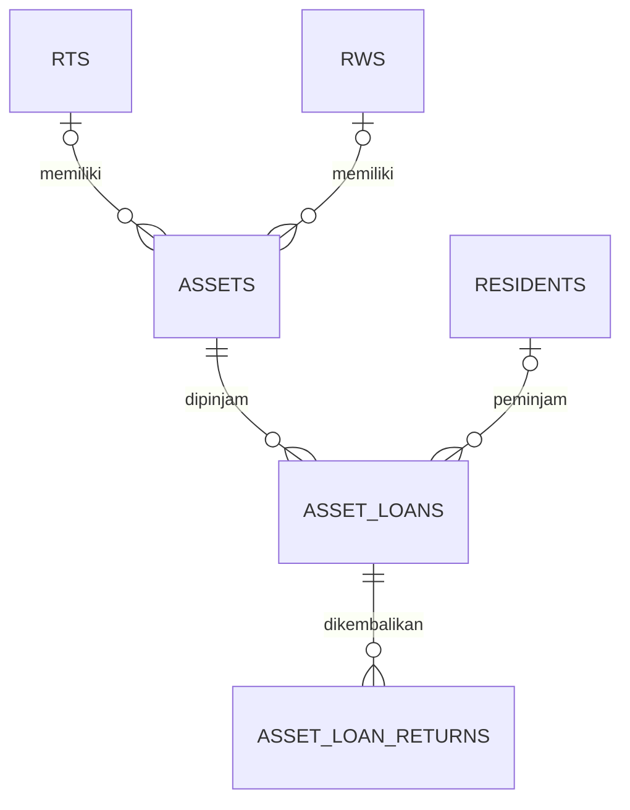

# RW Digitalisasi
## Dokumen PRD, ERD, Kamus Data, Matriks Akses, dan Acceptance Criteria

**Versi:** 1.3 — Final for Approval  
**Status:** Final for Approval — desain fisik dan urutan migration ditambahkan; implementasi migration belum dijalankan  
**Tanggal:** 25 September 2026  
**Tujuan:** Menjadi acuan bersama untuk perancangan dan vibe coding aplikasi RW Digitalisasi.

> **Catatan penting:** Dokumen ini merangkum rancangan yang telah dibahas. Keputusan yang masih terbuka ditandai sebagai *Pending* pada bagian keputusan terbuka. Jangan membuat atau mengubah migration, struktur database, maupun SQL berdasarkan bagian yang masih pending sebelum disetujui.

---

# 1. Product Requirements Document (PRD)

## 1.1 Ringkasan Produk

RW Digitalisasi adalah aplikasi web untuk membantu administrasi satu RW yang memiliki banyak RT. Aplikasi menyediakan pengelolaan data wilayah dan warga, iuran, pembayaran, kas, persuratan, pengumuman, kegiatan, absensi, inventaris, laporan, notifikasi, dan audit aktivitas.

Aplikasi ditujukan untuk demo/tugas kuliah terlebih dahulu, dengan rancangan yang tetap memperhatikan kemungkinan penggunaan nyata.

## 1.2 Tujuan

1. Mendigitalisasi administrasi RW dan RT.
2. Memusatkan data warga dan kartu keluarga dengan pembatasan akses sesuai wilayah.
3. Membuat proses tagihan, pembayaran manual, verifikasi, dan pencatatan kas lebih tertata.
4. Memudahkan warga mengajukan surat dan memperoleh informasi kegiatan/pengumuman.
5. Menyediakan laporan per RT dan rekap RW.
6. Mencatat aktivitas penting melalui audit log.

## 1.3 Ruang Lingkup

### Termasuk dalam rancangan

- Autentikasi dan manajemen akun/role.
- Pengelolaan RW, RT, kartu keluarga, dan warga.
- Pendaftaran warga mandiri dengan verifikasi petugas.
- Jenis iuran, tagihan, pembayaran manual, bukti bayar, verifikasi, dan alokasi pembayaran.
- Kas RW dan kas RT yang terpisah, dengan laporan gabungan.
- Pengajuan, proses, persetujuan, dan keluaran surat.
- Pengumuman dan target penerima.
- Kegiatan, pendaftaran peserta, sesi absensi QR, log pemindaian, dan absensi.
- Inventaris serta peminjaman/pengembalian barang.
- Notifikasi, audit log, dan laporan.

### Di luar cakupan yang telah disepakati

- Integrasi payment gateway berbayar.
- Pembayaran cicilan/parsial untuk suatu tagihan.
- Pelacakan lokasi/GPS saat absensi QR.
- Fitur tambahan yang belum tercantum atau belum disetujui dalam dokumen ini.

## 1.4 Pengguna dan Peran

1. **Super Admin** — mengelola konfigurasi dan akun lintas wilayah serta memiliki akses administratif tertinggi.
2. **RW Admin/Ketua RW** — mengelola data dan aktivitas tingkat RW, mengawasi seluruh RT, menyetujui transaksi kas RW, dan melihat laporan gabungan.
3. **RT Admin/Ketua RT** — mengelola data dan aktivitas RT dalam lingkupnya serta menyetujui transaksi kas RT sesuai kewenangan.
4. **Bendahara RT** — mengelola/verifikasi pembayaran iuran dan pencatatan keuangan RT sesuai lingkup RT yang ditugaskan.
5. **Sekretaris RW** — menangani proses persuratan dan kegiatan sesuai kewenangannya.
6. **Warga** — melihat informasi, melakukan pembayaran iuran manual, mengunggah bukti bayar, mengajukan surat, mendaftar kegiatan, dan melihat status permohonan miliknya.

> Penetapan apakah satu akun boleh memiliki beberapa role dan beberapa cakupan wilayah masih Pending (D-07).

## 1.5 Modul dan Kebutuhan Fungsional

### A. Autentikasi dan akun
- Pengguna dapat masuk dan keluar dari aplikasi.
- Hak akses diperiksa di sisi server, bukan hanya dengan menyembunyikan menu.
- Pendaftaran warga mandiri harus berstatus menunggu verifikasi petugas sebelum memperoleh akses penuh.
- Proses verifikasi email, pemulihan akun, dan kebijakan aktivasi masih Pending (D-05).

### B. Wilayah, keluarga, dan warga
- Super Admin dapat mengelola data RW dan RT.
- Petugas dapat mengelola data warga sesuai wilayah kewenangannya.
- Warga dikelompokkan ke dalam kartu keluarga.
- Data pribadi dibatasi sesuai peran dan cakupan RT/RW.
- Perubahan data penting dicatat pada audit log.

### C. Iuran dan pembayaran
- Petugas dapat mengatur jenis iuran dan menerbitkan tagihan sesuai periode.
- Warga dapat melihat tagihan miliknya.
- Pembayaran dilakukan melalui transfer manual dan unggah bukti pembayaran.
- Satu pembayaran dapat dialokasikan ke satu atau beberapa tagihan, tetapi setiap tagihan harus dilunasi penuh; pembayaran parsial tidak diperbolehkan.
- Verifikasi dilakukan oleh petugas yang berwenang untuk cakupan tagihan tersebut.
- Status pembayaran dan tagihan harus konsisten dan dapat ditelusuri.

### D. Kas dan laporan keuangan
- Kas RW dan kas setiap RT dipisahkan.
- Laporan konsolidasi RW dapat menggabungkan ringkasan kas RW dan seluruh RT tanpa menghilangkan identitas sumber.
- Bendahara mengajukan transaksi pengeluaran; Ketua RT/RW menyetujui sesuai lingkup.
- Bukti transaksi dapat diunggah.
- Transfer antar rekening kas dicatat secara eksplisit dan tidak dihitung sebagai pendapatan/beban baru pada laporan konsolidasi.
- Detail akun kas, saldo awal, periode pembukuan, dan ambang persetujuan masih Pending (D-02, D-03, D-08).

### E. Persuratan
- Warga dapat mengajukan surat dan memantau statusnya.
- Petugas memproses permohonan sesuai jenis surat dan alur persetujuan.
- Jenis surat, persyaratan, format nomor, dan alur final ditentukan pengurus.
- Dokumen surat yang dihasilkan disimpan dan dapat diakses sesuai hak akses.

### F. Pengumuman
- Petugas dapat membuat pengumuman dengan target RW, RT tertentu, atau kelompok penerima yang diizinkan.
- Warga hanya melihat pengumuman yang ditujukan kepadanya atau bersifat umum untuk wilayahnya.

### G. Kegiatan dan absensi
- Petugas dapat membuat dan mengelola kegiatan.
- Warga dapat melihat kegiatan dan mendaftar jika pendaftaran diaktifkan.
- QR absensi menggunakan token dinamis dengan masa berlaku 60 detik.
- Tidak menggunakan geolokasi.
- Sistem mencatat log pemindaian dan hasil absensi.
- Panitia dapat mencatat kehadiran secara manual sebagai fallback bagi warga tanpa akun.

### H. Inventaris
- Petugas berwenang dapat mencatat barang inventaris, kondisi, dan lokasi.
- Peminjaman serta pengembalian barang dicatat dengan status dan riwayat.

### I. Notifikasi, audit, dan laporan
- Sistem menyediakan notifikasi untuk perubahan status penting.
- Audit log menyimpan aktor, tindakan, objek, waktu, dan metadata yang relevan.
- Laporan disaring berdasarkan periode dan cakupan akses.
- Ekspor data dan retensi audit masih perlu ditetapkan pada D-10.

## 1.6 Kebutuhan Nonfungsional

- **Keamanan:** autentikasi, otorisasi server-side, validasi input, perlindungan CSRF, pembatasan unggahan, dan penyimpanan password dengan hashing Laravel.
- **Privasi:** data sensitif hanya tersedia bagi role yang membutuhkan; NIK dan data keluarga tidak ditampilkan secara berlebihan.
- **Integritas:** foreign key, constraint, transaksi database untuk operasi multi-tabel, dan validasi status.
- **Auditabilitas:** perubahan dan persetujuan penting dapat ditelusuri.
- **Usability:** antarmuka berbahasa Indonesia, responsif desktop dan mobile.
- **Maintainability:** struktur Laravel mengikuti konvensi framework, validasi dan otorisasi dipisahkan dengan jelas, serta tersedia automated tests untuk alur utama.
- **Penyimpanan:** dokumen dan bukti pembayaran disimpan melalui mekanisme storage yang dikonfigurasi; provider dan retensi masih Pending (D-06).

## 1.7 Asumsi dan Batasan

- Satu RW memiliki banyak RT.
- Pembayaran pada MVP adalah transfer manual dengan bukti unggahan.
- Tidak ada payment gateway berbayar.
- Pembayaran tagihan bersifat lunas penuh.
- Kas RW dan kas RT dipisah.
- Absensi QR tidak memakai geolokasi dan token berlaku 60 detik.
- Keputusan yang berstatus Pending harus ditetapkan sebelum skema database dianggap final.

---

# 2. ERD (Entity Relationship Diagram)

Diagram berikut merupakan ERD konseptual/logis. Tipe kolom, panjang field, enum final, dan constraint implementasi perlu ditetapkan saat desain fisik disetujui.

## 2.1 Wilayah, akun, dan warga

## 2.2 Iuran dan pembayaran

## 2.3 Kas dan transaksi keuangan

## 2.4 Persuratan

## 2.5 Pengumuman, kegiatan, dan absensi

## 2.6 Inventaris

---

# 3. Kamus Data

## 3.1 Konvensi umum

- Tabel menggunakan primary key `id` (umumnya BIGINT unsigned) kecuali ditetapkan berbeda saat desain fisik.
- Timestamp `created_at` dan `updated_at` digunakan pada tabel transaksional yang relevan.
- Foreign key wajib memiliki indeks dan aturan penghapusan yang tidak merusak histori.
- Nama kolom berikut adalah rancangan logis; tipe, nullable, panjang, enum, unique key, dan delete behavior harus difinalisasi pada desain fisik.
- Untuk unggahan, simpan path/metadata file, bukan binary file langsung di tabel.
- Kolom sensitif harus dibatasi aksesnya dan tidak dimasukkan ke log secara mentah.

## 3.2 Master wilayah dan akun

| Tabel | Tujuan | Kolom/atribut utama |
|---|---|---|
| `rws` | Data master RW | `id`, `name`, `code`, `address`, `is_active` |
| `rts` | Data RT dalam RW | `id`, `rw_id`, `number`, `name`, `address`, `is_active` |
| `families` | Kartu keluarga | `id`, `rt_id`, `family_number`/nomor KK terenkripsi atau terlindungi, `address`, `head_resident_id`, `status` |
| `residents` | Data individu warga | `id`, `family_id`, `nik` terlindungi, `full_name`, `birth_place`, `birth_date`, `gender`, `religion` bila dibutuhkan, `occupation`, `phone`, `status`, `verification_status` |
| `users` | Akun login | `id`, `resident_id` nullable, `rw_id` nullable, `rt_id` nullable, `name`, `email`, `phone`, `password`, `status`, `email_verified_at`, `last_login_at` |
| `roles` | Master role | `id`, `name`, `slug`, `description` |
| `user_roles` | Pengaitan akun dan role | `id`, `user_id`, `role_id`, `scope_type`, `scope_id` |

## 3.3 Iuran dan pembayaran

| Tabel | Tujuan | Kolom/atribut utama |
|---|---|---|
| `fee_types` | Jenis iuran | `id`, `rw_id`/`rt_id` sesuai cakupan, `name`, `description`, `amount`, `period_type`, `is_active` |
| `fee_bills` | Tagihan warga | `id`, `fee_type_id`, `resident_id`, `period_key`, `amount_due`, `due_date`, `status`, `settled_at` |
| `payments` | Header pembayaran manual | `id`, `user_id`, `payer_resident_id`, `payment_date`, `total_amount`, `method`, `reference_number`, `status`, `notes` |
| `payment_allocations` | Alokasi pembayaran ke tagihan | `id`, `payment_id`, `fee_bill_id`, `allocated_amount` |
| `payment_proofs` | Bukti transfer | `id`, `payment_id`, `file_path`, `original_filename`, `mime_type`, `file_size`, `uploaded_by`, `uploaded_at` |
| `payment_verifications` | Histori verifikasi | `id`, `payment_id`, `verified_by`, `decision`, `notes`, `verified_at` |

## 3.4 Kas dan keuangan

| Tabel | Tujuan | Kolom/atribut utama |
|---|---|---|
| `cash_accounts` | Rekening/kas per RW atau RT | `id`, `rw_id` nullable, `rt_id` nullable, `name`, `account_type`, `opening_balance`, `is_active` |
| `cash_categories` | Kategori pemasukan/pengeluaran | `id`, `scope_type`, `scope_id`, `name`, `transaction_type`, `is_active` |
| `cash_transactions` | Buku kas | `id`, `cash_account_id`, `category_id`, `transaction_type`, `amount`, `transaction_date`, `description`, `status`, `created_by`, `approved_at` |
| `cash_transaction_approvals` | Jejak persetujuan transaksi | `id`, `cash_transaction_id`, `approver_id`, `decision`, `notes`, `acted_at` |
| `cash_transaction_proofs` | Bukti transaksi kas | `id`, `cash_transaction_id`, `file_path`, `uploaded_by`, `uploaded_at` |
| `cash_transfers` | Transfer antar kas | `id`, `source_account_id`, `destination_account_id`, `amount`, `transfer_date`, `description`, `created_by`, `status` |

## 3.5 Persuratan

| Tabel | Tujuan | Kolom/atribut utama |
|---|---|---|
| `letter_types` | Jenis surat dan konfigurasi | `id`, `scope_type`, `scope_id`, `name`, `description`, `requirements`, `template_path`, `is_active` |
| `letter_requests` | Permohonan surat | `id`, `letter_type_id`, `resident_id`, `request_number`, `purpose`, `form_data`, `status`, `submitted_at`, `completed_at` |
| `letter_workflows` | Definisi/alur proses | `id`, `letter_type_id`, `name`, `is_active` |
| `letter_workflow_steps` | Tahapan alur | `id`, `workflow_id`, `step_order`, `role_id`, `action_name`, `is_required` |
| `letter_approvals` | Keputusan per permohonan | `id`, `letter_request_id`, `user_id`, `step_order`, `decision`, `notes`, `acted_at` |
| `letter_outputs` | File surat final | `id`, `letter_request_id`, `file_path`, `document_number`, `generated_by`, `generated_at` |

## 3.6 Pengumuman, kegiatan, dan absensi

| Tabel | Tujuan | Kolom/atribut utama |
|---|---|---|
| `announcements` | Pengumuman | `id`, `created_by`, `title`, `body`, `published_at`, `expires_at`, `status` |
| `announcement_targets` | Sasaran pengumuman | `id`, `announcement_id`, `target_type`, `target_id` |
| `events` | Kegiatan | `id`, `created_by`, `rw_id` nullable, `rt_id` nullable, `title`, `description`, `location`, `starts_at`, `ends_at`, `registration_enabled`, `status` |
| `event_registrations` | Pendaftaran peserta | `id`, `event_id`, `resident_id`, `status`, `registered_at` |
| `attendance_sessions` | Sesi absensi/QR | `id`, `event_id`, `token_hash`, `valid_from`, `valid_until`, `created_by`, `status` |
| `attendance_scan_logs` | Log pemindaian QR | `id`, `session_id`, `resident_id` nullable, `scanned_by`, `token_valid`, `result`, `scanned_at` |
| `attendances` | Kehadiran final | `id`, `event_id`, `resident_id`, `session_id` nullable, `attendance_method`, `marked_by`, `status`, `attended_at` |

## 3.7 Inventaris, audit, dan notifikasi

| Tabel | Tujuan | Kolom/atribut utama |
|---|---|---|
| `assets` | Barang inventaris | `id`, `rw_id` nullable, `rt_id` nullable, `asset_code`, `name`, `description`, `quantity`, `condition`, `storage_location`, `status` |
| `asset_loans` | Peminjaman barang | `id`, `asset_id`, `borrower_resident_id` nullable, `borrower_name`, `quantity`, `loan_date`, `due_date`, `status`, `approved_by` |
| `asset_loan_returns` | Pengembalian barang | `id`, `asset_loan_id`, `returned_quantity`, `condition_after`, `received_by`, `returned_at`, `notes` |
| `audit_logs` | Audit tindakan penting | `id`, `user_id` nullable, `action`, `subject_type`, `subject_id`, `old_values` terbatas, `new_values` terbatas, `ip_address`, `user_agent`, `created_at` |
| `notifications` | Notifikasi pengguna | `id`, `user_id`, `type`, `title`, `body`, `data`, `read_at`, `created_at` |

## 3.8 Aturan integritas penting

1. Setiap RT terhubung ke satu RW.
2. Kartu keluarga berada dalam satu RT; warga terhubung ke kartu keluarga.
3. Akun warga, jika terkait dengan data warga, hanya boleh ditautkan secara konsisten.
4. Nomor KK/NIK harus dilindungi; aturan uniqueness dan enkripsi/masking difinalisasi pada desain fisik.
5. Satu tagihan tidak boleh dilunasi lebih dari sekali atau dialokasikan melebihi jumlah tagihan.
6. Pembayaran yang diajukan warga berstatus menunggu sampai diverifikasi petugas berwenang.
7. Pembayaran tagihan bersifat penuh; alokasi parsial ke tagihan tidak diperbolehkan.
8. Perubahan status pembayaran dan tagihan dilakukan secara transaksional.
9. Transaksi kas yang memerlukan persetujuan tidak memengaruhi saldo final sebelum disetujui.
10. Transfer antar kas harus memiliki akun sumber dan tujuan berbeda; pencatatan laporan konsolidasi harus menghindari penghitungan ganda.
11. Token QR disimpan dalam bentuk aman (misalnya hash) dan berlaku maksimal 60 detik.
12. Absensi unik per warga per kegiatan, kecuali aturan kegiatan secara eksplisit mengizinkan lain.
13. File bukti harus divalidasi berdasarkan ukuran, MIME/ekstensi, dan hak akses.
14. Catatan keuangan dan persetujuan tidak dihapus permanen tanpa kebijakan retensi yang disetujui.

---

# 4. Matriks Akses (RBAC)

Legenda: **Kelola** = membuat/mengubah sesuai cakupan; **Lihat** = baca; **Ajukan** = membuat permohonan/transaksi; **Verifikasi** = menyetujui/menolak sesuai kewenangan; **—** = tidak memiliki akses standar.

| Modul/Aksi | Super Admin | RW Admin | RT Admin | Bendahara RT | Sekretaris RW | Warga |
|---|---|---|---|---|---|---|
| Kelola akun/role | Kelola semua | Kelola sesuai kebijakan RW | Kelola akun RT bila diizinkan | — | — | Kelola profil sendiri terbatas |
| Kelola master RW | Kelola | Lihat/kelola operasional RW | Lihat | — | Lihat | Lihat informasi publik |
| Kelola master RT | Kelola | Kelola seluruh RT | Lihat/kelola RT sendiri sesuai aturan | Lihat RT sendiri | Lihat | Lihat RT sendiri |
| Data warga/KK | Semua cakupan | Lihat/kelola seluruh RW | Kelola RT sendiri | Lihat sesuai kebutuhan tugas | Lihat sesuai kebutuhan surat | Lihat/ubah data sendiri melalui alur verifikasi |
| Verifikasi pendaftaran warga | Semua cakupan | Verifikasi RW | Verifikasi RT sendiri jika ditetapkan | — | — | — |
| Jenis iuran/tagihan | Konfigurasi | Kelola kebijakan RW | Kelola iuran RT jika diizinkan | Kelola/operasikan sesuai penugasan | — | Lihat tagihan sendiri |
| Ajukan pembayaran | — | Untuk akun sendiri bila juga warga | Untuk akun sendiri bila juga warga | Untuk akun sendiri bila juga warga | Untuk akun sendiri bila juga warga | Ajukan pembayaran sendiri |
| Verifikasi pembayaran iuran | Audit/override administratif dengan log | Sesuai kebijakan; tidak otomatis menyetujui semua RT | Tidak otomatis, kecuali diberi kewenangan | Verifikasi warga pada RT tugasnya | — | — |
| Kas RW | Lihat/audit | Kelola dan setujui sesuai alur | Lihat ringkasan yang diizinkan | — | Lihat jika diperlukan tugas | Lihat laporan publik jika dipublikasikan |
| Kas RT | Lihat/audit | Lihat seluruh RT dan laporan gabungan | Kelola dan setujui transaksi RT sendiri sesuai alur | Ajukan/catat transaksi RT sendiri | — | Lihat laporan publik jika dipublikasikan |
| Persuratan | Administrasi sistem | Lihat/kelola sesuai kebijakan | Membantu verifikasi data RT bila ditetapkan | — | Kelola proses surat RW | Ajukan dan lihat surat milik sendiri |
| Pengumuman | Kelola semua | Kelola lingkup RW | Kelola lingkup RT sendiri | — | Kelola lingkup RW bila diizinkan | Lihat target yang sesuai |
| Kegiatan | Kelola semua | Kelola kegiatan RW | Kelola kegiatan RT sendiri | — | Kelola kegiatan RW | Lihat/daftar kegiatan |
| Absensi kegiatan | Audit | Kelola sesi RW | Kelola sesi RT sendiri | — | Kelola jika panitia | Scan/lihat kehadiran sendiri |
| Inventaris | Kelola semua | Kelola/monitor RW dan RT | Kelola inventaris RT sendiri | Lihat/catat sesuai penugasan | — | Ajukan pinjam jika fitur diaktifkan |
| Laporan | Semua laporan | Laporan RW dan konsolidasi RT | Laporan RT sendiri | Laporan keuangan RT sesuai tugas | Laporan persuratan/kegiatan sesuai tugas | Laporan pribadi dan informasi publik |
| Audit log | Akses penuh | Akses terbatas pada lingkup RW jika diizinkan | Akses terbatas jika diizinkan | — | — | — |

## 4.1 Aturan RBAC

- Otorisasi wajib diterapkan di backend melalui middleware/policy/gate atau mekanisme Laravel yang setara.
- Pembatasan harus mempertimbangkan role **dan** scope RW/RT, bukan role saja.
- Warga tidak boleh membaca data pribadi warga lain, bukti pembayaran orang lain, atau dokumen surat orang lain.
- Bendahara RT hanya memverifikasi pembayaran sesuai RT yang ditugaskan.
- Setiap keputusan verifikasi/approval harus mencatat pengguna, waktu, keputusan, dan catatan.
- Super Admin tidak boleh mengubah atau menghapus histori transaksi tanpa jejak audit.
- Role stacking dan banyak scope per akun masih Pending (D-07).

---

# 5. Acceptance Criteria

Acceptance criteria berikut digunakan sebagai dasar pengujian fitur. Detail yang bergantung pada keputusan Pending harus diselesaikan sebelum kriteria terkait dinyatakan final.

## 5.1 Autentikasi dan otorisasi
- [ ] Pengguna dengan kredensial valid dapat login dan logout.
- [ ] Kredensial salah ditolak dengan pesan yang aman.
- [ ] Password tersimpan dalam bentuk hash, bukan teks biasa.
- [ ] Endpoint dan halaman terlindungi menolak pengguna tanpa autentikasi.
- [ ] Pengguna yang tidak memiliki role/scope sesuai tidak dapat mengakses data melalui URL atau request langsung.
- [ ] Pengguna yang dinonaktifkan tidak dapat login.
- [ ] Pendaftaran warga baru berstatus menunggu verifikasi dan tidak memperoleh akses penuh sebelum diverifikasi.

## 5.2 Wilayah dan data warga
- [ ] Super Admin dapat membuat dan mengelola data RW/RT.
- [ ] RT selalu terhubung ke RW yang valid.
- [ ] Petugas RT hanya dapat mengelola warga pada RT yang menjadi cakupannya.
- [ ] Warga dapat ditautkan ke satu kartu keluarga sesuai aturan data.
- [ ] Sistem memvalidasi field wajib dan format data.
- [ ] NIK/nomor KK tidak ditampilkan secara penuh kepada role yang tidak berwenang.
- [ ] Perubahan data penting tercatat di audit log.

## 5.3 Tagihan dan pembayaran
- [ ] Petugas berwenang dapat membuat jenis iuran dan tagihan sesuai periode yang ditentukan.
- [ ] Warga hanya dapat melihat tagihan miliknya.
- [ ] Warga dapat membuat pengajuan pembayaran manual dan mengunggah bukti.
- [ ] File bukti divalidasi tipe dan ukurannya.
- [ ] Pengajuan pembayaran tidak langsung dianggap lunas sebelum diverifikasi.
- [ ] Verifikator hanya dapat memproses pembayaran dalam scope kewenangannya.
- [ ] Satu pembayaran dapat dialokasikan ke beberapa tagihan sesuai aturan.
- [ ] Sistem menolak pembayaran parsial untuk satu tagihan.
- [ ] Sistem menolak alokasi melebihi sisa tagihan atau pembayaran yang sama dipakai ganda.
- [ ] Setelah disetujui, status pembayaran, tagihan, dan catatan keuangan diperbarui secara konsisten.
- [ ] Penolakan pembayaran menyimpan alasan dan dapat dilihat oleh pemohon.

## 5.4 Kas dan laporan keuangan
- [ ] Kas RW dan kas setiap RT terpisah secara logis.
- [ ] Pengeluaran diajukan oleh petugas yang berwenang dan tidak masuk saldo final sebelum approval jika approval diwajibkan.
- [ ] Ketua RT/RW hanya dapat menyetujui transaksi pada scope-nya.
- [ ] Bukti transaksi dapat diunggah dan hanya dapat dilihat oleh pengguna berwenang.
- [ ] Saldo dihitung dari transaksi yang memenuhi status pembukuan.
- [ ] Transfer antar akun kas tercatat sebagai transfer, bukan pendapatan/beban baru pada laporan konsolidasi.
- [ ] Laporan RT hanya memuat data RT terkait.
- [ ] Laporan RW dapat menampilkan rekap gabungan dan rincian per RT.
- [ ] Perhitungan saldo, pemasukan, pengeluaran, dan saldo akhir konsisten dengan data transaksi.
- [ ] Transaksi yang sudah disetujui tidak dapat diubah secara diam-diam; koreksi harus memiliki jejak audit.

## 5.5 Persuratan
- [ ] Warga dapat mengajukan surat yang tersedia dan mengisi field/persyaratan yang diwajibkan.
- [ ] Warga hanya dapat melihat permohonan dan file surat miliknya.
- [ ] Petugas dapat memproses permohonan sesuai alur dan kewenangannya.
- [ ] Setiap perubahan status tercatat beserta aktor dan waktu.
- [ ] Surat yang selesai memiliki nomor dokumen dan file keluaran sesuai konfigurasi yang disetujui.
- [ ] Permohonan yang ditolak menyimpan alasan penolakan.

## 5.6 Pengumuman dan kegiatan
- [ ] Petugas dapat membuat, mengubah, menerbitkan, dan mengarsipkan pengumuman sesuai scope.
- [ ] Warga hanya melihat pengumuman yang sesuai target wilayah/penerimanya.
- [ ] Petugas dapat membuat kegiatan dengan waktu, lokasi, dan deskripsi.
- [ ] Warga dapat melihat kegiatan dan mendaftar jika pendaftaran diaktifkan.
- [ ] Sistem mencegah pendaftaran ganda untuk kegiatan yang sama.
- [ ] Kegiatan yang dibatalkan tidak menerima pendaftaran baru.

## 5.7 QR attendance
- [ ] Sesi absensi menghasilkan token QR yang berubah/berlaku dalam jendela 60 detik.
- [ ] Token kedaluwarsa ditolak.
- [ ] Token tidak dapat digunakan untuk mencatat kehadiran ganda bagi warga yang sama pada kegiatan yang sama.
- [ ] Sistem tidak meminta atau menyimpan geolokasi untuk absensi.
- [ ] Log pemindaian menyimpan waktu dan hasil validasi.
- [ ] Panitia yang berwenang dapat mencatat kehadiran manual dan sistem mencatat siapa yang menandai.

## 5.8 Inventaris
- [ ] Petugas dapat mencatat dan memperbarui inventaris sesuai scope.
- [ ] Kode inventaris unik sesuai aturan yang ditetapkan.
- [ ] Peminjaman mencatat peminjam, jumlah, tanggal, dan status.
- [ ] Pengembalian mencatat jumlah dan kondisi setelah pengembalian.
- [ ] Sistem mencegah jumlah pinjaman melebihi jumlah tersedia.
- [ ] Riwayat peminjaman/pengembalian tetap dapat ditelusuri.

## 5.9 Notifikasi, audit, dan kualitas
- [ ] Peristiwa penting menghasilkan notifikasi sesuai konfigurasi.
- [ ] Notifikasi dapat ditandai telah dibaca.
- [ ] Audit log mencatat tindakan penting tanpa menyimpan rahasia/password atau data sensitif berlebihan.
- [ ] Filter laporan mengikuti role, scope, dan periode yang diizinkan.
- [ ] Antarmuka dapat digunakan pada desktop dan layar mobile.
- [ ] Validasi server-side diterapkan untuk seluruh input penting.
- [ ] Alur utama memiliki automated test, termasuk test akses lintas RT.
- [ ] Tidak ada error kritis pada alur login, pembayaran, approval, persuratan, dan laporan saat acceptance testing.

---

# 6. Keputusan Terbuka (Pending)

Keputusan berikut harus diselesaikan dan disetujui sebelum desain database final dan implementasi terkait.

| ID | Topik | Keputusan yang dibutuhkan |
|---|---|---|
| D-01 | Konfigurasi iuran | Jenis iuran, nominal, periode, tanggal jatuh tempo, denda, dan aturan perubahan tarif. |
| D-02 | Akun kas | Jumlah/jenis akun kas RW dan RT, rekening tunai/bank, dan aturan transfer antar akun. |
| D-03 | Persetujuan pengeluaran | Siapa mengajukan, siapa menyetujui, jumlah tahap, ambang nominal, dan mekanisme penolakan/koreksi. |
| D-04 | Persuratan | Jenis surat, field/persyaratan, alur persetujuan, template, format nomor, dan tanda tangan/stempel. |
| D-05 | Akun dan verifikasi | Verifikasi email, verifikasi warga, pemulihan password, aktivasi akun, dan siapa yang boleh menyetujui. |
| D-06 | Infrastruktur | Hosting, storage file, SMTP, backup, batas ukuran unggahan, retensi, dan pemulihan data. |
| D-07 | Role dan scope | Apakah satu akun boleh memiliki banyak role dan/atau menangani beberapa RT/RW. |
| D-08 | Pembukuan | Saldo awal, periode buku kas, tutup buku, koreksi transaksi, dan saldo historis. |
| D-09 | Alokasi pembayaran | Apakah satu pembayaran dapat dialokasikan ke tagihan dari lebih dari satu scope kas (RW dan RT). |
| D-10 | Privasi dan audit | Retensi audit, ekspor data, masking/enkripsi NIK/KK, hak akses data sensitif, dan prosedur penghapusan. |

---

# 7. Gerbang Persetujuan Sebelum Implementasi

Sebelum membuat migration, model, controller, atau SQL:

1. Tinjau seluruh bagian PRD, ERD, kamus data, matriks akses, dan acceptance criteria.
2. Selesaikan keputusan D-01 sampai D-10 atau tandai secara eksplisit keputusan yang akan ditunda untuk MVP.
3. Buat revisi final desain database dan catat perubahan.
4. Minta persetujuan eksplisit pemilik proyek.
5. Setelah disetujui, baru pecah implementasi menjadi fase-fase kecil dan jalankan automated tests setiap fase.

**Status dokumen:** Draft v1.2 — belum disetujui sebagai spesifikasi final implementasi.

---

# 8. Keputusan D-01 sampai D-10 — Ditetapkan untuk MVP

Bagian ini mengunci keputusan operasional untuk MVP. Keputusan berikut menjadi acuan bagi desain fisik dan implementasi. Perubahan selanjutnya harus dicatat sebagai revisi dokumen.

## D-01 — Konfigurasi iuran
- Jenis awal: keamanan, kebersihan, iuran RW, dan iuran tambahan yang dapat dikonfigurasi.
- Nominal dan cakupan ditentukan pengurus berwenang.
- Periode bulanan sebagai default; periode lain dapat dikonfigurasi.
- Tanggal jatuh tempo dapat diatur per jenis iuran.
- Tidak ada denda otomatis pada MVP.
- Perubahan tarif berlaku untuk tagihan periode berikutnya; tagihan terbit tidak berubah otomatis.

## D-02 — Akun kas
- Kas RW dan kas setiap RT dipisahkan.
- Akun kas mendukung tunai dan rekening bank.
- Dapat terdapat lebih dari satu akun pada setiap lingkup.
- Transfer antar akun dicatat pada `cash_transfers`.
- Laporan konsolidasi tidak menghitung transfer internal sebagai pemasukan/pengeluaran baru.

## D-03 — Persetujuan pengeluaran
- Pengeluaran RT diajukan bendahara RT dan disetujui Ketua RT terkait.
- Pengeluaran RW diajukan bendahara/petugas keuangan RW yang ditugaskan dan disetujui Ketua RW.
- Satu tahap persetujuan pada MVP, tanpa ambang nominal berbeda.
- Transaksi menunggu persetujuan tidak memengaruhi saldo final.
- Penolakan wajib memiliki alasan.
- Koreksi transaksi yang telah disetujui harus memiliki jejak audit.

## D-04 — Persuratan
- Jenis awal: surat pengantar RT/RW, domisili, usaha, tidak mampu, keterangan umum, dan jenis administrasi lain yang ditambahkan pengurus.
- Alur standar: warga mengajukan → RT memeriksa → Sekretaris RW memproses → Ketua RW menyetujui jika diperlukan → surat diterbitkan.
- Jenis surat, persyaratan, template, dan alur dapat dikonfigurasi petugas berwenang.
- Nomor surat dibuat otomatis dengan format yang dapat dikonfigurasi.
- Keluaran berupa PDF.
- Tanda tangan/stempel pada MVP berupa ruang tanda tangan/stempel atau gambar yang disediakan pengurus; bukan tanda tangan elektronik tersertifikasi.

## D-05 — Akun dan verifikasi
- Warga dapat mendaftar mandiri.
- RT memverifikasi identitas warga sesuai cakupan RT.
- Akun menunggu verifikasi sebelum memperoleh akses penuh.
- Verifikasi email dan reset password menggunakan SMTP melalui konfigurasi lingkungan.
- Jika SMTP belum tersedia pada demo, verifikasi email dapat dinonaktifkan melalui konfigurasi; verifikasi identitas warga tetap berlaku.
- Akun petugas dibuat/ditetapkan Super Admin atau RW Admin sesuai kewenangan.

## D-06 — Infrastruktur MVP
- Pengembangan lokal; demo menggunakan hosting yang mendukung Laravel dan MySQL/MariaDB jika tersedia.
- Database MySQL/MariaDB.
- Laravel Storage; disk lokal untuk pengembangan.
- SMTP dikonfigurasi melalui `.env`, tanpa kredensial di source code.
- Backup manual sebelum demo/perubahan besar; prosedur restore perlu diuji.
- Batas unggahan 5 MB per file.
- Bukti pembayaran: JPG, JPEG, PNG, PDF.
- Dokumen surat: PDF.
- Data transaksi dan surat disimpan selama masa proyek; kebijakan operasional lebih lanjut perlu mengikuti ketentuan yang berlaku.

## D-07 — Role dan scope
- Satu akun boleh memiliki beberapa role dan beberapa scope RT/RW.
- Satu akun menggunakan satu kredensial login.
- Role dan scope dicatat melalui `user_roles`.
- Otorisasi menggunakan kombinasi role dan scope.
- Penambahan/pencabutan role dicatat dalam audit log.

## D-08 — Pembukuan
- Saldo awal dapat dimasukkan ketika akun kas dibuat dan dibedakan dari pendapatan operasional.
- Periode pembukuan default Januari–Desember.
- Tutup buku tahunan dilakukan bendahara dan disetujui Ketua RT/RW sesuai lingkup.
- Saldo historis tetap dapat dilihat.
- Koreksi/pembatalan transaksi harus menyimpan alasan dan jejak audit.
- Transaksi yang disetujui tidak dihapus permanen melalui antarmuka biasa.

## D-09 — Alokasi pembayaran
- Satu pembayaran hanya dapat dialokasikan ke tagihan dalam satu scope kas.
- Pembayaran iuran RW dan RT dilakukan secara terpisah.
- Satu pembayaran dapat melunasi beberapa tagihan dalam scope yang sama.
- Pelunasan tagihan harus penuh; pembayaran parsial tidak diperbolehkan.
- Total alokasi harus sama dengan total pembayaran yang diverifikasi.
- Sistem menolak alokasi ganda atau melebihi tagihan.

## D-10 — Privasi dan audit
- NIK dan nomor KK dilindungi dengan enkripsi aplikasi-level dan dimasking pada tampilan sesuai kewenangan.
- Pencarian exact menggunakan hash SHA-256 dari nilai ternormalisasi; hash tidak menggantikan enkripsi data asli.
- Akses data sensitif dibatasi berdasarkan tugas dan scope.
- Audit log disimpan minimal 2 tahun untuk MVP.
- Ekspor data hanya oleh Super Admin/petugas berwenang sesuai scope.
- Akun dinonaktifkan, bukan menghapus histori transaksi.
- Audit log tidak boleh menyimpan password, token, atau rahasia autentikasi.

---

# 9. Desain Fisik Database MySQL/MariaDB

## 9.1 Konvensi desain
- Primary key: `BIGINT UNSIGNED AUTO_INCREMENT`.
- Engine yang disarankan: InnoDB; charset/collation menggunakan `utf8mb4` yang kompatibel dengan versi MariaDB/MySQL target.
- Waktu disimpan konsisten, disarankan UTC di database dan ditampilkan dalam zona waktu aplikasi `Asia/Jakarta`.
- Nominal uang menggunakan `DECIMAL(15,2)` (bukan FLOAT/DOUBLE).
- Kolom status menggunakan `VARCHAR` dengan validasi aplikasi dan/atau `CHECK` yang kompatibel; nilai status harus ditetapkan sebagai konstanta domain.
- Foreign key menggunakan tipe yang sama dengan primary key referensinya.
- Tabel transaksi/histori tidak menggunakan cascade delete yang menghapus catatan keuangan atau audit.
- File disimpan di Laravel Storage; database hanya menyimpan path dan metadata.
- Kolom JSON hanya digunakan untuk data fleksibel yang memang diperlukan, bukan menggantikan relasi utama.

## 9.2 Perlindungan NIK dan nomor KK
Untuk `residents.nik` dan `families.family_number`:
- Nilai asli dienkripsi di aplikasi sebelum disimpan, menggunakan mekanisme enkripsi Laravel atau layanan key management yang sesuai.
- Kolom penyimpanan ciphertext menggunakan `TEXT` atau ukuran yang memadai untuk ciphertext dan metadata.
- Tambahkan kolom `nik_hash` / `family_number_hash` bertipe `CHAR(64)` untuk pencarian exact berdasarkan SHA-256 dari nilai yang telah dinormalisasi.
- Hash tidak dapat digunakan untuk menampilkan kembali nilai asli dan bukan pengganti enkripsi.
- Jangan membuat index pada ciphertext untuk pencarian biasa.
- Jangan menulis nilai NIK/KK mentah ke log, URL, pesan error, atau audit log.
- Masking dilakukan pada Resource/DTO/view sesuai role; hindari mengandalkan accessor model sebagai satu-satunya kontrol keamanan.
- Akses ke data lengkap harus melalui policy/otorisasi backend.

## 9.3 Scope multi-role dan multi-scope
Tabel `user_roles` menyimpan `user_id`, `role_id`, `scope_type` (`RW` atau `RT`), dan `scope_id`.
- `scope_id` mengacu pada `rws.id` atau `rts.id` sesuai `scope_type`.
- Karena foreign key polimorfik tidak dapat menjamin referensi ke dua tabel secara langsung, integritas scope wajib divalidasi di service/domain layer dan diuji.
- Alternatif yang lebih kuat untuk integritas referensial adalah menggunakan kolom `rw_id` dan `rt_id` nullable dengan constraint bahwa tepat satu terisi, atau tabel scope terpisah. Pilihan implementasi final harus ditetapkan sebelum migration.
- Unique constraint logis: kombinasi pengguna, role, tipe scope, dan ID scope tidak boleh duplikat.

## 9.4 Aturan pembayaran dan scope kas
- Setiap `fee_bill` harus memiliki cakupan kas yang dapat ditentukan secara konsisten dari jenis iuran/konfigurasi.
- Service pembayaran harus memastikan semua tagihan dalam satu pembayaran berada pada scope kas yang sama.
- `allocated_amount` harus sama dengan nilai penuh tagihan yang dilunasi.
- Total seluruh alokasi harus sama dengan total pembayaran yang diverifikasi.
- Validasi dilakukan dalam transaksi database dengan locking yang sesuai untuk mencegah dua pembayaran melunasi tagihan yang sama secara bersamaan.
- Tambahkan unique constraint pada `payment_allocations.fee_bill_id` jika kebijakan melarang tagihan dialokasikan lebih dari satu kali; tetap lakukan validasi status dan locking di service.
- Constraint lintas tabel seperti kecocokan scope dan kesamaan total membutuhkan validasi service/transaction; jangan mengandalkan foreign key saja.

## 9.5 Kas, transfer, dan pembukuan
- Setiap akun kas dimiliki tepat oleh satu scope RW atau RT.
- Untuk menjaga integritas, desain fisik perlu memilih pola scope: (a) `scope_type` + `scope_id` dengan validasi service, atau (b) `rw_id`/`rt_id` nullable dengan constraint tepat satu terisi.
- Transfer harus memiliki akun sumber dan tujuan yang berbeda.
- Transfer yang disetujui/selesai menghasilkan pasangan mutasi yang dapat ditelusuri atau diposting melalui mekanisme ledger yang konsisten.
- Transfer internal tidak masuk kategori pemasukan/pengeluaran operasional pada laporan konsolidasi.
- Saldo awal dicatat sebagai opening balance, bukan transaksi pendapatan biasa.
- Transaksi yang sudah diposting tidak diedit langsung; gunakan reversal/koreksi yang terhubung ke transaksi asal.

## 9.6 Urutan migration Laravel yang diusulkan

Urutan di bawah mempertahankan urutan yang diajukan dan menandai dependensi yang perlu diperhatikan.

1. `create_rws_table`
2. `create_rts_table` — FK ke `rws`
3. `create_families_table` — FK ke `rts`; `head_resident_id` ditambahkan setelah `residents` tersedia atau melalui migration alter terpisah
4. `create_residents_table` — FK ke `families`
5. `create_users_table` — FK ke `residents`, `rws`, `rts`
6. `create_roles_table`
7. `create_user_roles_table` — FK ke `users`, `roles`; scope polimorfik perlu validasi aplikasi atau pola FK alternatif
8. `create_fee_types_table` — FK ke `rws`, `rts`
9. `create_fee_bills_table` — FK ke `fee_types`, `residents`
10. `create_payments_table` — FK ke `users`, `residents`
11. `create_payment_allocations_table` — FK ke `payments`, `fee_bills`
12. `create_payment_proofs_table` — FK ke `payments`, `users`
13. `create_payment_verifications_table` — FK ke `payments`, `users`
14. `create_cash_accounts_table` — FK ke `rws`, `rts`
15. `create_cash_categories_table` — scope RW/RT
16. `create_cash_transactions_table` — FK ke `cash_accounts`, `cash_categories`, `users`
17. `create_cash_transaction_approvals_table` — FK ke `cash_transactions`, `users`
18. `create_cash_transaction_proofs_table` — FK ke `cash_transactions`, `users`
19. `create_cash_transfers_table` — FK ke `cash_accounts`, `users`
20. `create_letter_types_table` — scope RW/RT
21. `create_letter_requests_table` — FK ke `letter_types`, `residents`
22. `create_letter_workflows_table` — FK ke `letter_types`
23. `create_letter_workflow_steps_table` — FK ke `letter_workflows`, `roles`
24. `create_letter_approvals_table` — FK ke `letter_requests`, `users`
25. `create_letter_outputs_table` — FK ke `letter_requests`, `users`
26. `create_announcements_table` — FK ke `users`
27. `create_announcement_targets_table` — FK ke `announcements`; scope target divalidasi
28. `create_events_table` — FK ke `users`, `rws`, `rts`
29. `create_event_registrations_table` — FK ke `events`, `residents`
30. `create_attendance_sessions_table` — FK ke `events`, `users`
31. `create_attendance_scan_logs_table` — FK ke `attendance_sessions`, `residents`, `users`
32. `create_attendances_table` — FK ke `events`, `residents`, `attendance_sessions`, `users`
33. `create_assets_table` — FK ke `rws`, `rts`
34. `create_asset_loans_table` — FK ke `assets`, `residents`, `users`
35. `create_asset_loan_returns_table` — FK ke `asset_loans`, `users`
36. `create_audit_logs_table` — FK ke `users` nullable dengan perilaku histori yang aman
37. `create_notifications_table` — FK ke `users`

### Catatan dependensi migration
- Ada dependensi melingkar antara `families.head_resident_id` dan `residents.family_id`. Buat tabel `families` terlebih dahulu tanpa FK kepala keluarga, buat `residents`, lalu tambahkan `head_resident_id` melalui migration alter.
- Bila `users.resident_id` unik dan nullable, pastikan aturan satu akun per data warga ditetapkan.
- Tabel `cash_transfers` perlu status/approval dan referensi aktor; jika transfer memerlukan persetujuan kedua scope, tambahkan struktur approval transfer secara eksplisit sebelum implementasi.
- Tabel `fee_types` harus mempunyai cara deterministik menentukan scope kas RW/RT; jangan mengandalkan nama jenis iuran.
- Kolom `scope_type`/`scope_id` tidak otomatis memiliki FK ke beberapa tabel. Validasi scope harus dirancang dan diuji.
- Audit log harus tetap dapat menyimpan catatan saat akun pengguna dihapus/nonaktif; gunakan nullable FK dan kebijakan delete yang tidak menghapus histori.

---

# 10. Rencana Model Eloquent

Daftar model yang direncanakan:

| Model | Relasi utama |
|---|---|
| `Rw` | hasMany `Rt`, `CashAccount`, `Event`; hasManyThrough/relasi sesuai kebutuhan untuk warga |
| `Rt` | belongsTo `Rw`; hasMany `Family`, `CashAccount`, `Asset` |
| `Family` | belongsTo `Rt`; hasMany `Resident`; belongsTo `Resident` sebagai kepala keluarga setelah relasi tersedia |
| `Resident` | belongsTo `Family`; hasOne/hasMany `User` sesuai aturan akun; hasMany `FeeBill`, `LetterRequest`, `Attendance` |
| `User` | belongsTo `Resident` nullable; belongsToMany `Role` melalui `user_roles`; hasMany audit/notifikasi |
| `Role` | belongsToMany `User` melalui `user_roles` |
| `FeeType` | hasMany `FeeBill`; scope RW/RT |
| `FeeBill` | belongsTo `FeeType`, `Resident`; hasMany `PaymentAllocation` |
| `Payment` | belongsTo `User` dan `Resident`; hasMany allocations, proofs, verifications |
| `PaymentAllocation` | belongsTo `Payment`, `FeeBill` |
| `CashAccount` | hasMany transactions; relasi scope RW/RT |
| `CashTransaction` | belongsTo account/category/user; hasMany approvals/proofs |
| `CashTransfer` | belongsTo source/destination account dan user |
| `LetterType` | hasMany requests/workflows |
| `LetterRequest` | belongsTo type/resident; hasMany approvals/outputs |
| `Announcement` | belongsTo creator; hasMany targets |
| `Event` | belongsTo creator; hasMany registrations/sessions/attendances |
| `AttendanceSession` | belongsTo event/creator; hasMany scan logs/attendances |
| `Asset` | hasMany loans |
| `AssetLoan` | belongsTo asset/resident/approver; hasMany returns |
| `AuditLog` | belongsTo user nullable; morph relation ke subject bila digunakan |
| `Notification` | belongsTo user |

Relasi final harus mengikuti nama foreign key migration yang disetujui dan diuji melalui model tests.

---

# 11. Rencana Seeder

Seeder untuk lingkungan development/demo:

1. `RoleSeeder` — mengisi role yang disepakati secara idempotent.
2. `DemoRwSeeder` — satu RW contoh.
3. `DemoRtSeeder` — beberapa RT contoh di bawah RW tersebut.
4. `DemoResidentSeeder` — data warga fiktif; jangan memakai NIK/KK nyata.
5. `DemoUserSeeder` — akun demo per role dengan password development yang aman dan hanya untuk lokal.
6. `FeeConfigurationSeeder` — jenis iuran contoh, diberi label data demo.
7. `CashAccountSeeder` — akun kas RW dan kas RT contoh dengan saldo awal demo.
8. `LetterTypeSeeder` — jenis surat awal dan template placeholder.
9. `CashCategorySeeder` — kategori pemasukan/pengeluaran dasar.
10. Seeder lain hanya ditambahkan bila diperlukan oleh test atau demo.

Ketentuan:
- Seeder dapat dijalankan ulang tanpa menduplikasi master data.
- Jangan menjalankan akun/password demo pada production.
- Kredensial demo tidak boleh ditulis ke repository untuk deployment publik.
- Semua data warga demo harus fiktif.

---

# 12. Rencana Pengujian Database dan Akses

## 12.1 Database
- [ ] Semua migration berjalan pada database kosong MySQL/MariaDB versi target.
- [ ] `migrate:rollback`/fresh hanya diuji pada database development/test, bukan database berisi data penting.
- [ ] Semua foreign key mengarah ke tabel/kolom yang benar.
- [ ] Unique constraint mencegah data master/transaksi ganda sesuai aturan.
- [ ] Tipe data uang menggunakan DECIMAL dan tidak mengalami pembulatan floating-point.
- [ ] Constraint/status invalid ditolak oleh validasi aplikasi dan database bila didukung.
- [ ] Penghapusan master tidak menghapus histori keuangan/audit secara tidak sengaja.
- [ ] Dependensi melingkar keluarga-warga ditangani melalui migration alter.

## 12.2 Multi-role dan scope
- [ ] Akun dapat memiliki beberapa role dan scope tanpa duplikasi assignment.
- [ ] Role Bendahara RT hanya dapat memverifikasi pembayaran RT yang ditugaskan.
- [ ] Pengguna RT 01 tidak dapat membaca/mengubah data RT 02 melalui UI maupun request langsung.
- [ ] RW Admin dapat melihat rekap lintas RT sesuai kewenangannya.
- [ ] Warga tidak dapat mengakses data pribadi, pembayaran, atau surat milik warga lain.
- [ ] Perubahan role/scope tercatat dalam audit log.

## 12.3 Pembayaran
- [ ] Pembayaran satu scope tidak dapat dialokasikan ke tagihan scope lain.
- [ ] Pembayaran parsial ditolak.
- [ ] Alokasi ganda terhadap tagihan ditolak.
- [ ] Total alokasi harus sama dengan total pembayaran yang disetujui.
- [ ] Dua request bersamaan tidak dapat melunasi tagihan yang sama dua kali.
- [ ] Pembayaran ditolak tidak mengubah tagihan menjadi lunas.

## 12.4 Kas
- [ ] Pengeluaran pending tidak mengurangi saldo final.
- [ ] Hanya approver scope yang dapat menyetujui.
- [ ] Transfer tidak boleh memiliki akun sumber dan tujuan yang sama.
- [ ] Transfer internal tidak menambah pendapatan/pengeluaran konsolidasi.
- [ ] Saldo awal tidak dihitung sebagai pendapatan operasional.
- [ ] Koreksi transaksi meninggalkan jejak yang dapat ditelusuri.

## 12.5 Privasi dan unggahan
- [ ] NIK/KK terenkripsi sebelum tersimpan.
- [ ] Pencarian hash hanya digunakan untuk pencocokan exact dan hash dihitung dari nilai ternormalisasi.
- [ ] NIK/KK dimasking pada tampilan untuk role yang tidak berwenang.
- [ ] File lebih dari 5 MB ditolak.
- [ ] File dengan MIME/ekstensi tidak diizinkan ditolak.
- [ ] File bukti tidak dapat diakses publik tanpa otorisasi.
- [ ] Audit log tidak memuat password, token, atau nilai NIK/KK mentah.

---

# 13. Gerbang Implementasi

Status dokumen ini adalah **v1.3 — Final for Approval** sebagai rancangan untuk ditinjau.

Sebelum migration dibuat:
1. Tinjau dan setujui desain fisik, terutama pola foreign key untuk scope RW/RT dan hubungan keluarga-kepala keluarga.
2. Pastikan versi Laravel dan MySQL/MariaDB aktual dari proyek.
3. Tentukan apakah struktur database lokal sudah memiliki data yang harus dipertahankan.
4. Setelah persetujuan eksplisit, buat migration secara bertahap.
5. Jalankan migration hanya pada database development/test terlebih dahulu.
6. Tinjau hasil migration dan test sebelum menerapkan ke database lain.

**Tidak ada migration yang dijalankan atau database yang diubah oleh dokumen ini.**
